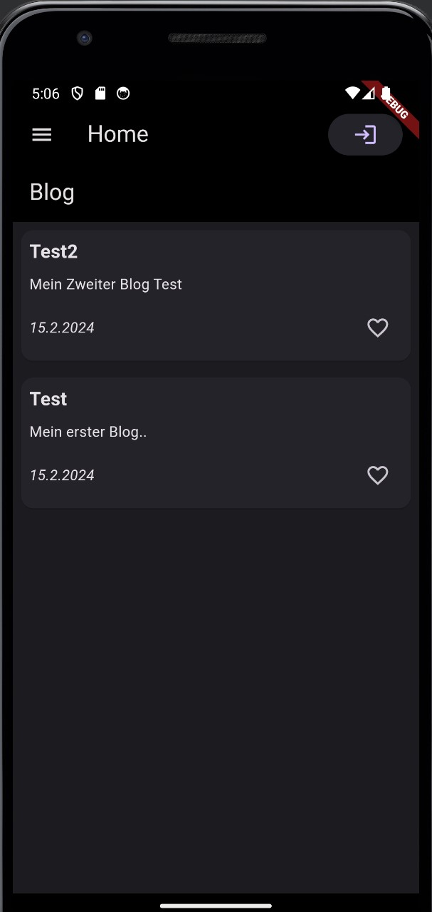
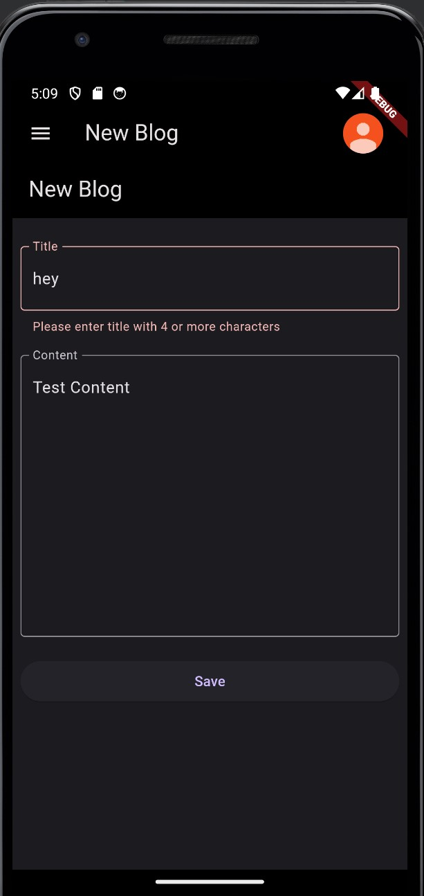
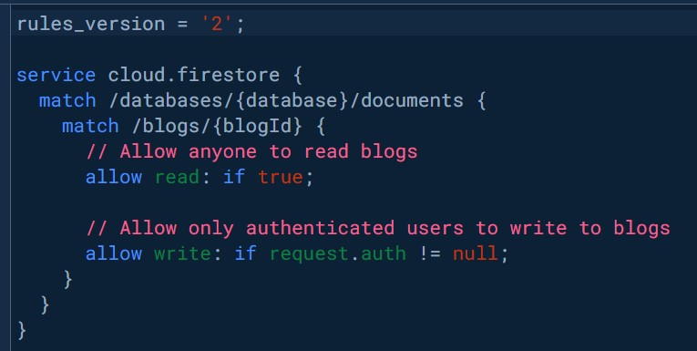

## Flutter Blog App
<div align="center">

</div>
This mobile application is developed as part of the Mobile Computing course at HFTM in Grenchen, transitioning from a conceptual blog system to a fully functional Flutter application with Firebase as its backend.

<!-- Table of Contents -->
<details>
  <summary><strong>Table of Contents</strong></summary>
  <ol>
    <li><a href="#Introduction">Introduction</a></li>
    <li><a href="#Setup Instructions">Setup Instructions</a></li>
    <li><a href="#Firebase Integration">Firebase Integration</a></li>
    <li><a href="#Architecture and State Management">Architecture and State Management</a></li>
    <li><a href="#Description of Individual Files">Description of Individual Files</a></li>
    <li><a href="#Technical Decisions">Technical Decisions</a></li>
    <li><a href="#API Overview">API Overview</a></li>
    <li><a href="#Access Concept and User Roles">Access Concept and User Roles</a></li>
    <li><a href="#Contributing">Contributing</a></li>
    
  </ol>
</details>

 -------------------------------------------------------------------------------------------------------
 ## Introduction

Welcome to the Flutter Blog App project, a comprehensive mobile application developed with Flutter and Firebase. This app allows users to authenticate, read, create, and manage blog posts in real-time, showcasing seamless integration with Firebase Firestore and Firebase Authentication services.

 -------------------------------------------------------------------------------------------------------
 ## Setup Instructions

This guide will walk you through the necessary steps to get the Flutter Blog App running on your local environment. Whether you're a seasoned developer or just starting, follow these instructions to set up the project and dive into the world of Flutter development.

Prerequisites:


- Flutter SDK installed on your system.
- An IDE or code editor of your choice (e.g., Visual Studio Code, Android Studio).
- Basic understanding of Flutter & Dart language.


**Local Setup:**
1. <b>Clone the Repository:</b> Start by cloning the repository to your local machine. Use the command `git clone` with the actual repository link.

2. <b>Install Dependencies:</b> Navigate to the project directory in your terminal and run `flutter pub get` to fetch and install all the necessary dependencies defined in the `pubspec.yaml` file.

3. <b>Open and Configure the Project:</b> Open the project in your preferred IDE and ensure that the Flutter SDK is correctly set up and recognized by your development environment.

4. <b>Run the App:</b> Launch an emulator or connect a physical device to your computer. Execute `flutter run` within the project directory to build and run the app.

 -------------------------------------------------------------------------------------------------------
## Firebase Integration

This project leverages Firebase Firestore for real-time data storage and synchronization across devices. Firebase Authentication is used to authenticate users via Google Sign-In, ensuring secure access and interaction with the blog posts.


**Firebase Project Setup:**
1. <b>Create a Firebase Project:</b> Visit [Firebase Console](https://console.firebase.google.com/), sign in with your Google account, and create a new project.

2. <b>Enable Authentication and Firestore:</b> In the Firebase console, navigate to the Authentication section to enable Google Sign-In (or other methods as per your requirement). Similarly, set up Firestore Database in test mode or configure security rules according to your app's needs.

3. <b>Configure Firebase SDK:</b> For Android and iOS, you'll need to download the `google-services.json`  and place it in the 
`android/app` directory.

For a detailed step-by-step guide on setting up Firebase in your Flutter app, including configurations for various platforms, please visit the official 
[Firebase-Flutter setup documentation.](https://firebase.google.com/docs/flutter/setup?platform=android)

**Integrating Firebase in Flutter:**

1. <b>Add Firebase Core to Your App:</b> Ensure your pubspec.yaml includes firebase_core, and run flutter pub get to install it.
```sh
dependencies:
  flutter:
    sdk: flutter
  firebase_core: ^2.25.4
```
2. <b>Initialize Firebase:</b> In your `main.dart`, import Firebase and initialize it within the main function using `Firebase.initializeApp().`

```sh
void main() async {
  WidgetsFlutterBinding.ensureInitialized();
  await Firebase.initializeApp(
    options: DefaultFirebaseOptions.currentPlatform,
  );

  runApp(
    ChangeNotifierProvider(
      create: (_) => MyAuthProvider(),
      child: const MainApp(),
    ),
  );
}
```

3. <b>Use Firebase Services:</b> Now, you can start using various Firebase services in your app. For authentication, you can use `FirebaseAuth` to sign in, sign out, and manage users. 
```sh
class MyAuthProvider with ChangeNotifier {
  User? _user;

  MyAuthProvider() {
    FirebaseAuth.instance.authStateChanges().listen((User? user) {
      _user = user;
      notifyListeners();
    });
  }

  User? get user => _user;

  Future<void> logout() async {
    await FirebaseAuth.instance.signOut();
  }
}
```


For storing and retrieving data, `FirebaseFirestore` can be utilized to interact with your Firestore database.
```sh
  final CollectionReference<Blog> _blogCollection =
  FirebaseFirestore.instance.collection('blogs').withConverter<Blog>(
    fromFirestore: (snapshots, _) => Blog.fromJson(snapshots.data()!, snapshots.id),
    toFirestore: (blog, _) => blog.toJson(),
  );
```

**Additional Resources:**

- <b>Firebase in Flutter Tutorial:</b> For a step-by-step video guide on integrating  <a href="https://www.youtube.com/watch?v=9hpEtJVK48Q&t=201s">Firebase with Flutter</a> consider watching Firebase in Flutter on YouTube.

- <b>FlutterFire Documentation:</b> Explore the  [Firebase documentation.](https://firebase.flutter.dev/docs/overview/)
 for detailed instructions on using different Firebase services in your Flutter app.

By following these steps, you've integrated Firebase into your Flutter Blog App, leveraging powerful services like Firestore for data storage and Firebase Authentication for managing user sessions. This setup forms the backbone of the app's functionality, enabling real-time data synchronization and secure user authentication across devices.


 -------------------------------------------------------------------------------------------------------
## Architecture and State Management


The app is structured around a clean architecture, separating concerns and facilitating scalability and maintenance. State management is handled using the Provider package, offering a simple yet efficient way to manage app state reactively.

**Models(lib/models):** 

Contains data models such as `Blog` which define the structure of the objects used throughout the app. These models are crucial for typing the data interacted with on Firebase Firestore.

**Providers(lib/providers):** 

Includes state management logic that interacts with Firebase to authenticate users, fetch, add, update, and delete blog posts. Providers notify listeners (UI components) about state changes, triggering a rebuild with new data.

**Screens(lib/screens):** 

Comprises various UI screens of the app. This includes the `HomePage` for listing all blog posts, `BlogDetailPage` for viewing individual blog posts, and `LoginPage` for user authentication.

**Services(lib/services):** 

Encapsulates the business logic of interacting with Firebase services. It abstracts the Firestore `CRUD` operations and authentication methods, making them reusable across the app.

 -------------------------------------------------------------------------------------------------------
## Description of Individual Files


Further details on individual files and their responsibilities are outlined in this section, ensuring a clear understanding of the project structure and flow.

**firebase_options.dart:** 

This file is automatically generated by the FlutterFire CLI and contains the configuration for all Firebase services used in the project. It includes API keys, project IDs, and other necessary details to initialize Firebase correctly in your application.

**main.dart:** 

The entry point of the application. It sets up Firebase, the app theme, and the navigation routes. This file is responsible for running the app and initializing the MainScreen as the home screen, wrapped inside a `ChangeNotifierProvider` to manage app state.

**pubspec.yaml:** 

Defines the app's metadata and manages the dependencies used by the project. It lists all the packages the app needs, such as `firebase_core`, `cloud_firestore`, `firebase_auth`, and `provider`, among others. This file also includes configuration for assets like images and fonts.

**/lib/screens/login_page.dart:**

 Manages user sign-in using Firebase Authentication. It features a simple UI prompting users to sign in with their Google account, facilitating OAuth flows.

**/lib/screens/home_page.dart:** 

Displays a list of blog posts fetched from Firebase Firestore. This screen is the main interface of the app, where users can navigate to read, edit, or create new blog posts.

**/lib/screens/blog/blog_new_page.dart:** 


Manages the creation of new blog posts, allowing users to input title and content, which are then saved to Firebase Firestore.

**/lib/screens/blog/blog_detail_page.dart:** 

Displays the details of a blog post, including the title, content, and publication date, and offers edit and delete functionalities for post authors.


**/lib/services/blog_repository.dart:** 

Encapsulates the logic for interacting with the Firestore database. It includes methods for fetching, adding, updating, and deleting blog posts, abstracting these operations away from the UI code.

**/lib/models/blog.dart:** 

Defines the data model for a blog post, including fields like title, content, authorId, and publishedAt. This model ensures consistent data structure when working with blog posts throughout the app.

**/lib/providers/auth_provider.dart and /lib/providers/blog_provider.dart:** 


These files contain the logic for managing authentication state and blog post data within the app. 
`auth_provider.dart` listens to Firebase Auth state changes and manages user sessions, while `blog_provider.dart` fetches and updates blog posts in the UI based on interactions with Firebase Firestore.


 -------------------------------------------------------------------------------------------------------

## Technical Decisions
In developing the Flutter Blog App, several key technical decisions were made to ensure a smooth, efficient, and scalable application. Here are some of the highlights:

**State Management:** The app utilizes the Provider package for state management. This choice was driven by Provider's simplicity and effectiveness in managing app state, especially in a Flutter environment where data needs to be shared across different screens and widgets. It allows for a clean separation of business logic from UI components, facilitating easier maintenance and testing.


**Firebase Integration:** Firebase Firestore and Firebase Authentication were chosen as the backend services for their real-time data synchronization capabilities and secure authentication mechanisms. Firestore serves as a flexible, scalable database for storing and syncing blog posts, while Firebase Authentication provides a robust solution for managing user sessions with Google Sign-In.

**Modular Architecture:** The app's architecture is designed to be modular, with a clear separation of concerns among different layers of the application. The `models` directory defines the data structure; `providers` handle the logic and state management; `screens` contain the UI components; and `services` abstract the communication with Firebase services. This modularity enhances the app's maintainability and scalability.

**UI/UX Considerations:** Flutter's rich widget library has been leveraged to create a user-friendly interface that is both appealing and intuitive. Special attention was given to the app's responsiveness and adaptive layout to ensure a seamless experience across different screen sizes and orientations.

**Security Measures:** Security is a top priority, particularly in handling user authentication and data access. The app implements best practices for securing Firebase services, including rules for Firestore to control data access and secure token handling for authentication.

These technical decisions underscore the commitment to building a high-quality, user-centric blog application that leverages modern development practices and tools.

 -------------------------------------------------------------------------------------------------------

## API Overview

The Flutter Blog App utilizes Firebase Firestore and Authentication to offer a real-time blogging experience with secure user authentication. Here's a breakdown of how the app interacts with Firebase:

**Firestore CRUD Operations:**

`Create:` Users can publish new blog posts, which are then stored in the Firestore database under a specific collection.

`Read:` The app retrieves blog posts from Firestore, displaying them in a list on the home screen. Users can also view detailed pages for each post.

`Update:` Blog post authors can edit their posts, updating the content stored in Firestore.

`Delete:` Authors can delete their posts, removing them from the Firestore database.


**Authentication:**

The app uses Firebase Authentication to manage user sessions. Users can sign in using their Google accounts, with the app leveraging OAuth for secure authentication.
Once authenticated, the user's session information is stored, allowing them to publish, edit, or delete their blog posts based on their user ID.
This interaction with Firebase not only ensures real-time data synchronization across devices but also maintains a secure and user-specific blogging experience.

 -------------------------------------------------------------------------------------------------------

## Access Concept and User Roles


The Flutter Blog App implements a straightforward access control system based on the user's authentication status:

**Guest (Unauthenticated):**
Can read blog posts but cannot create, edit, delete, or like posts.

**Authenticated User:** 
Can create new blog posts, edit and delete their own posts, and like posts.
This structure ensures that all visitors have access to reading material, while interactivity, such as creating and editing content, is limited to registered users.


 -------------------------------------------------------------------------------------------------------
## Contributing
Contributions are welcome! Please open an issue first to discuss your proposal, or directly submit a pull request.

 -------------------------------------------------------------------------------------------------------
