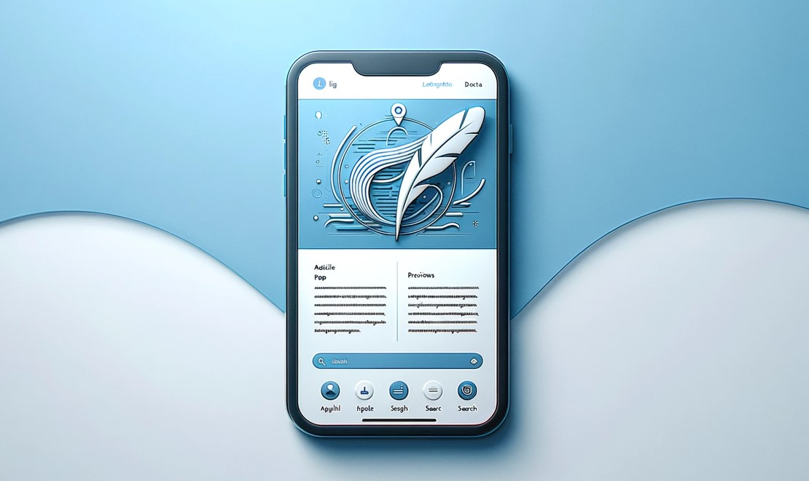

## Flutter Blog App

 

 

Currently, in my Mobile Computing course at HFTM in Grenchen, I am developing a mobile application using Flutter, designed to interface with the backend blog system I created in my Distributed Systems course.

<!-- Table of Contents -->

  
<strong>Table of Contents</strong>

  <ol>
    <li><a href="#Introduction">Introduction</a></li>
    <li><a href="#Setup Instructions">Setup Instructions</a></li>
    <li><a href="#Description of Individual Files">Description of Individual Files</a></li>
    <li><a href="#API Overview">API Overview</a></li>
    <li><a href="#Contributing">Contributing</a></li>
    <li><a href="#Addition">Addition</a></li>
  </ol>

 -------------------------------------------------------------------------------------------------------
 ## Introduction

Welcome to my Flutter Blog App project, a mobile application developed with Flutter as a frontend for the [Blog Backend Service](https://github.com/Leoislami/blog-backend). This app allows users to read, create, and manage blog posts, seamlessly integrating with the backend service.

 -------------------------------------------------------------------------------------------------------
 ## Setup Instructions

Prerequisites:

- Flutter SDK
- Access to the [Blog Backend Service](https://github.com/Leoislami/blog-backend)

Follow these steps to set up and run the project:

1. Clone the repository to your local machine.
2. Navigate to the project folder in your terminal.
3. Run `flutter pub get` to install the required packages.
4. Start the app with `flutter run`.

 -------------------------------------------------------------------------------------------------------
 ## Description of Individual Files

**Screens**: 

Contains various screens of the app, such as the home page, blog post creation screen, and login screen.

**Models**: 

Defines the data models used in the app, like BlogPost and User.

**Services**: 

Includes logic for communicating with the backend service.

**Widgets**: 

Contains reusable UI components used throughout the app.

 -------------------------------------------------------------------------------------------------------
 ## API Overview

The app interacts with the backend service through a RESTful API. It enables users to read, create, and manage blog posts. Authenticated users can publish new blog posts and manage their own entries.

 -------------------------------------------------------------------------------------------------------
 ## Contributing

Contributions are welcome! For major changes, please open an issue first to discuss what you would like to change.

 -------------------------------------------------------------------------------------------------------
 ## Addition

 -------------------------------------------------------------------------------------------------------
